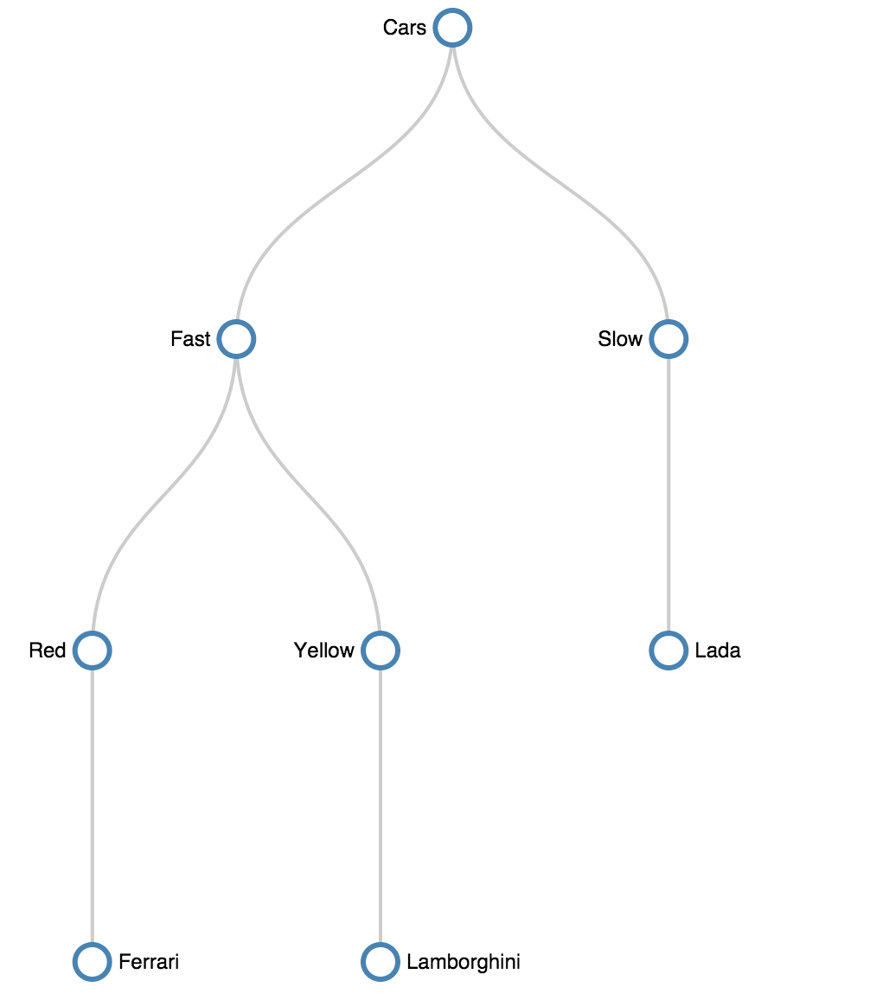

# EU Web2015
Work for EU WebChallenge 2015.  
[http://malizhev.github.io/euweb2015/](http://malizhev.github.io/euweb2015/)  
Implemented drawing of tree represented by preorder tree traversal method input using SVG.  

Initial data should look like this: 
```
[
    {
        name: "Cars",
        left: 1,
        right: 18
    },
    {
        name: "Fast",
        left: 2,
        right: 11
    },
    {
        name: "Red",
        left: 3,
        right: 6
    },
    ...
]
```

The following tree will be drawn:  


## How to install
First, install all dependencies. Then you can build the project:
```
  npm i
  npm run build
```
## What's inside
SVG drawing is built on d3.js.  
Powered by Babel and Browserify 
